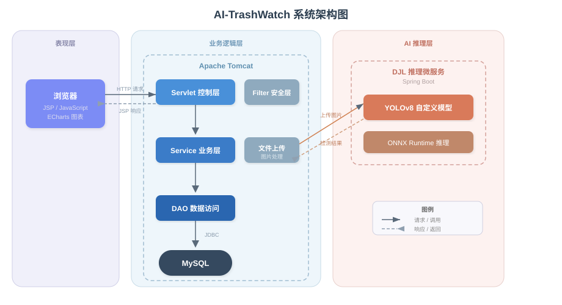
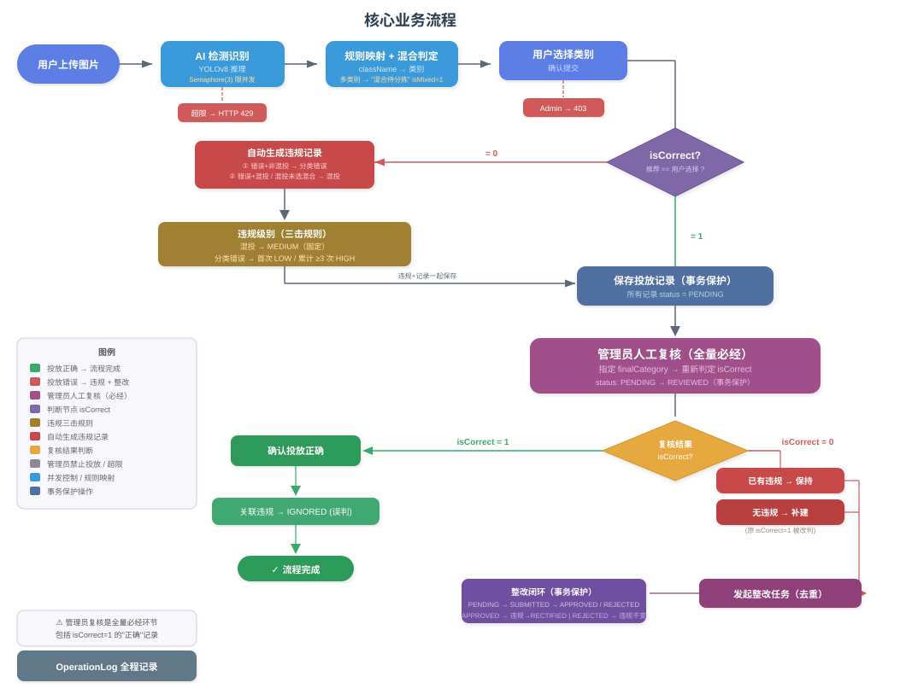

# AI-TrashWatch

> 基于 Java Web (Servlet + JSP + JDBC) 的垃圾分类 AI 识别与投放监管平台

AI-TrashWatch 通过集成 DJL 深度学习推理微服务，加载**自定义 YOLOv8 垃圾分类模型**，实现对 6 类生活垃圾的智能识别，并结合投放记录管理、违规自动判定、整改闭环处理及统计分析，构建从识别到监管的完整流程。

## ✨ 核心特性

- **🤖 AI 智能识别** — 集成 DJL + YOLOv8 自定义模型，支持 6 类垃圾检测
- **🚮 投放记录管理** — 完整记录每次投放，含原始图片与检测结果图对比
- **⚖️ 违规自动判定** — 用户选择与 AI 推荐不一致时自动生成违规记录，支持分级判定
- **🔄 整改闭环处理** — 发起整改 → 用户提交 → 管理员复核，全流程追溯
- **📊 统计分析** — ECharts 可视化：类别分布、正确率、7 天趋势、违规排名
- **🔧 分类规则管理** — 检测类别到业务类别的映射规则，可灵活配置
- **📚 分类知识库** — 按类别展示垃圾分类知识，支持 CRUD 管理

## 🎯 AI 模型识别能力

系统搭载**自定义训练的 YOLOv8s 垃圾分类模型**，可识别 6 类常见生活垃圾：

| 类别 | 英文标识 | 示例物品 |
|------|----------|----------|
| 🟤 可生物降解 | BIODEGRADABLE | 厨余、果皮、树叶 |
| 📦 纸板 | CARDBOARD | 快递纸箱、纸盒 |
| 🟢 玻璃 | GLASS | 玻璃瓶、碎玻璃 |
| 🔩 金属 | METAL | 易拉罐、金属瓶盖 |
| 📄 纸张 | PAPER | 报纸、打印纸、书籍 |
| 🧴 塑料 | PLASTIC | 塑料瓶、塑料袋 |

> 模型置信度阈值可配置（默认 0.5），识别结果支持人工复核修正。

## 🏗️ 系统架构



### 分层架构

| 层次 | 技术选型 | 说明 |
|------|---------|------|
| 表现层 | JSP + JSTL + CSS + JS | 服务端渲染，ECharts 统计图表 |
| 控制层 | Jakarta Servlet | 请求路由、参数校验、文件上传 |
| 业务层 | Java Service | 规则映射、违规判定、整改流程、级联处理 |
| 数据访问层 | JDBC + HikariCP | 原生 SQL，连接池管理 |
| 安全层 | Filter | 认证/授权/XSS 防护/编码过滤 |
| 推理服务 | DJL + YOLOv8 (Spring Boot) | 目标检测推理，HTTP REST 通信 |

### 核心业务流程



## 🛠️ 技术栈

| 类别 | 技术 |
|------|------|
| 语言 | Java 21 |
| Web | Jakarta Servlet 6.0 + JSP 3.1 + JSTL 2.0 |
| 数据库 | MySQL 8.0 |
| 连接池 | HikariCP 4.0 |
| 密码加密 | jBCrypt 0.4 |
| JSON | Jackson 2.16 |
| 日志 | SLF4J + Logback |
| AI 推理 | DJL (Deep Java Library) + YOLOv8 自定义模型 |
| 图表 | ECharts 5 |
| 构建 | Maven |
| 容器 | Tomcat 9.0 / 10.0 |

## 📁 项目结构

```
src/main/java/com/example/
├── controller/          # Servlet 控制层
│   ├── AdminDashboardServlet.java
│   ├── AdminGarbageRecordServlet.java
│   ├── AdminRectificationServlet.java
│   ├── AdminUserServlet.java
│   ├── AdminViolationServlet.java
│   ├── GarbageRecordServlet.java
│   ├── ImageServlet.java
│   ├── InferenceServlet.java
│   ├── KnowledgeServlet.java
│   ├── RectificationServlet.java
│   ├── RuleServlet.java
│   ├── StatisticsServlet.java
│   └── ViolationServlet.java
├── dao/                 # 数据访问层
├── filter/              # 过滤器（认证/授权/XSS/编码）
├── model/               # 实体/VO/DTO
├── service/             # 业务层
│   ├── DjlInferenceClient.java
│   ├── GarbageRecordService.java
│   ├── KnowledgeService.java
│   ├── RectificationService.java
│   ├── RuleService.java
│   ├── StatisticsService.java
│   ├── ViolationService.java
│   └── UserService.java
└── util/                # 工具类

src/main/webapp/
├── css/style.css        # 全局样式
└── WEB-INF/jsp/
    ├── nav-user.jsp      # 用户导航栏
    ├── nav-admin.jsp     # 管理员导航栏
    ├── user/             # 用户端页面
    └── admin/            # 管理员端页面
```

## 🗄️ 数据库设计

共 8 张表，运行于 MySQL `user_management` 数据库中：

| 表名 | 说明 |
|------|------|
| `user` | 用户表 |
| `operation_log` | 操作日志表 |
| `garbage_rule` | 分类规则表（className → mappedCategory） |
| `garbage_record` | 投放记录表 |
| `detection_result` | 检测明细表 |
| `violation_record` | 违规记录表 |
| `rectification_task` | 整改任务表 |
| `knowledge_base` | 知识库表 |

初始化脚本：`src/main/resources/init-garbage-tables.sql`

## 🚀 快速开始

### 前置条件

- JDK 21+
- Maven 3.8+
- MySQL 8.0+
- Tomcat 9.0+（主体应用）或 Tomcat 10.0+（微服务）
- DJL 目标检测微服务（[djl-spring-boot-starter-demo](https://github.com/deepjavalibrary/djl-demo)）

### 1. 初始化数据库

```sql
CREATE DATABASE IF NOT EXISTS user_management DEFAULT CHARSET utf8mb4;
USE user_management;

-- 执行已有 schema
source src/main/resources/schema.sql;

-- 执行垃圾分类扩展表
source src/main/resources/init-garbage-tables.sql;
```

### 2. 配置数据库连接

编辑 `src/main/resources/db.properties`：

```properties
db.url=jdbc:mysql://localhost:3306/user_management?useSSL=false&serverTimezone=Asia/Shanghai&characterEncoding=utf8mb4
db.username=root
db.password=your_password
```

### 3. 配置应用常量

编辑 `src/main/java/com/example/util/AppConstants.java`：

```java
// DJL 微服务地址
public static final String DJL_INFERENCE_URL = "http://localhost:8080";

// 图片目录
public static final String DJL_INPUT_DIR = "/path/to/data_set/input";
public static final String DJL_OUTPUT_DIR = "/path/to/data_set/output";
```

### 4. 启动 DJL 推理微服务

```bash
cd djl-spring-boot-starter-demo
mvn spring-boot:run
# 微服务默认运行在 http://localhost:8080
```

### 5. 构建并部署

```bash
# 构建 WAR
mvn clean package -DskipTests

# 部署到 Tomcat
cp target/user-management.war /path/to/tomcat/webapps/
```

### 6. 访问系统

- 应用地址：`http://localhost:8081/user_management_war_exploded/`
- 默认管理员账号：见 `schema.sql` 初始化数据

## 🔍 关键业务逻辑

### 人工复核判定

管理员指定 `finalCategory`（正确类别），与用户的 `selectedCategory` 对比：
- **一致** → 用户正确 → 违规记录标记为 `IGNORED`（误判）
- **不一致** → 用户错误 → 违规记录保持/恢复为 `PENDING`

### 违规自动生成

投放记录保存时，若用户选择类别与 AI 推荐类别不同，自动生成违规记录：
- 违规类型：`分类错误` 或 `混投`
- 违规级别：`LOW`（首次）/ `MEDIUM`（混投）/ `HIGH`（累计 ≥ 3 次）

### 级联删除

删除投放记录时，按顺序级联删除：整改任务 → 违规记录 → 检测明细 → 投放记录

## 📄 License

本项目基于 MIT License 开源。